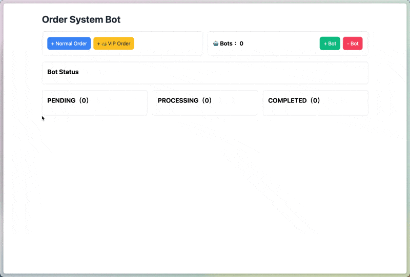

# Order System Bot

Order System Bot 為 Hotcake Software Engineer 回家作業

- 題目連結：[Hotcake Software Engineer Take Home Assignment](Hotcake-Software-Engineer-Take-Home-Assignment.d)
- Demo 連結：[Order System Bot](https://order-system-bot.web.app/)

這是一個麥當勞的訂餐管理系統，管理者可以新增及刪除機器人，來處理新增的訂單，並且訂單區分為一般訂單和 VIP 訂單，機器人會優先處理 VIP 訂單。

在管理頁面中，顯示了目前可使用的機器人數量、有多少張待處理的訂單、以及每筆訂單的處理狀態（PENDING、PROCESSING、COMPLETED），並且每一筆訂單上都會顯示該筆訂單的建立時間、處理時間以及完成時間。

## 安裝及執行專案

```bash
# 下載專案
git clone https://github.com/CarolLi05/order-system-bot.git

# 移動到專案資料夾
cd order-system-bot

# 安裝必要套件
npm install

# 執行專案
npm run start
```

# 第三方 Library 及開發技術

- 使用 React 18 + Vite 框架進行開發
- 使用 `redux-toolkit` 作為狀態管理工具
- 使用 Tailwind CSS 切版
- 透過 `day.js` 處理時間格式
- 使用 ESLint 進行語法檢查
- 使用 Prettier 進行程式碼格式化
- 使用 Firebase 進行部署


# 專案成果

1. 新增訂單及機器人，機器人優先處理 VIP 訂單。
2. 10 秒過後機器人完成訂單，機器人接續處理 PENDING 狀態的訂單，如果沒有訂單，機器人則轉為空閒狀態。 
3. 刪除機器人會從最新建立的機器人開始刪除，如果刪除正在處理訂單的機器人，訂單則會退回 PENDING 狀態。

